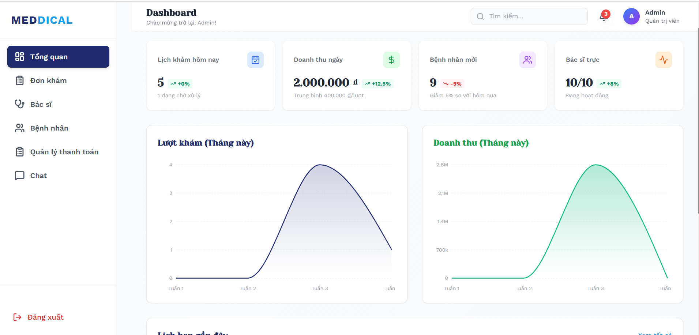
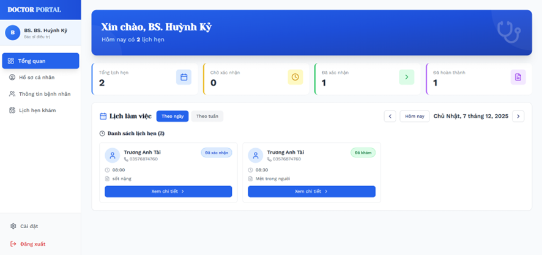
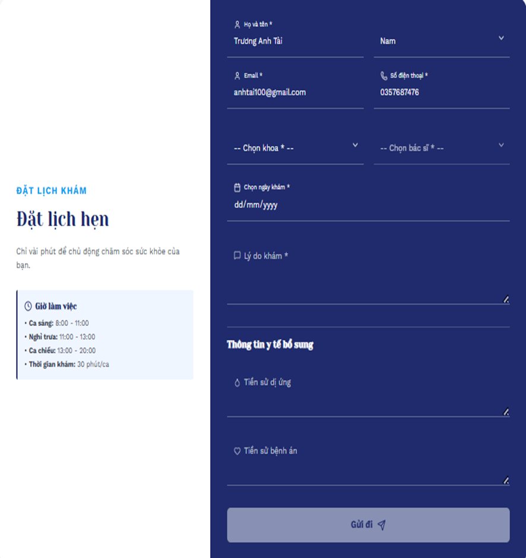

# 🏥 Hospital Management System


> Hệ thống quản lý bệnh viện mã nguồn mở được xây dựng bằng **Laravel (Backend)** và **ReactJS (Frontend)**.


### Giao diện Trang Chủ


### Giao diện Admin


### Giao Diện Bác sĩ

---
### Giao diện Bệnh Nhân

---
### Giao diện Đặt Lịch hẹn

---
## 📖 Tổng quan

**Hospital Management System** là một ứng dụng web giúp số hóa và tự động hóa các quy trình trong bệnh viện như quản lý bệnh nhân, bác sĩ, lịch hẹn, hồ sơ khám bệnh và thanh toán.

Dự án được xây dựng theo mô hình **tách biệt Frontend – Backend**, trong đó:
- **Laravel** cung cấp RESTful API
- **ReactJS** đảm nhiệm giao diện người dùng (SPA)

---

## ✨ Chức năng chính

### 👤 Bệnh nhân
- Đăng ký / đăng nhập
- Đặt lịch khám bệnh
- Xem lịch sử khám bệnh
- Xem hóa đơn và trạng thái thanh toán

### 🩺 Bác sĩ
- Quản lý lịch làm việc
- Xem danh sách lịch hẹn
- Cập nhật hồ sơ khám bệnh

### 🗓️ Quản lý lịch hẹn
- Tạo, cập nhật, hủy lịch hẹn
- Theo dõi trạng thái lịch hẹn
- Hỗ trợ tìm kiếm và phân trang

### 💳 Thanh toán
- Tạo hóa đơn khám bệnh
- Tích hợp thanh toán trực tuyến (VNPAY – sandbox)
- Xem lịch sử thanh toán

### 🛠️ Quản trị viên
- Quản lý người dùng và phân quyền
- Quản lý bác sĩ, khoa, dịch vụ
- Thống kê và báo cáo hệ thống

---

## 🛠️ Công nghệ sử dụng

### Backend
- PHP 8+
- Laravel 10+
- MySQL
- RESTful API
- Laravel Sanctum / JWT Authentication

### Frontend
- ReactJS
- React Router
- Axios
- Tailwind CSS

---

## 📂 Cấu trúc thư mục

```text
hospital-management/
├── backend/                 # Laravel Backend
│   ├── app/
│   ├── routes/
│   ├── database/
│   └── .env
│
├── frontend/                # ReactJS Frontend
│   ├── src/
│   │   ├── components/
│   │   ├── pages/
│   │   ├── api/
│   │   └── App.jsx
│   └── package.json
│
└── README.md
```

---

## 🚀 Hướng dẫn cài đặt

### 🔧 Yêu cầu hệ thống
- PHP >= 8.0
- Composer
- Node.js >= 18
- MySQL

---
### 🔧 Cài đặt Backend (Laravel)

```bash
cd backend
- composer install
- cp .env.example .env
- php artisan key:generate
- php artisan migrate --seed
- php artisan serve
```


---

### 🎨 Cài đặt Frontend (ReactJS)

```bash
cd frontend
npm install
npm run dev
```

Frontend chạy tại:  
👉 http://localhost:5173
Backend sẽ chạy tại:
👉 http://127.0.0.1:8000
